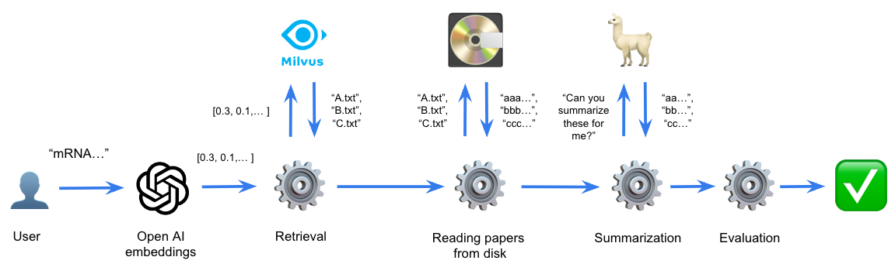

# 🦙 Paper Summarizer

This project has been developed using the following technologies:

* [Llama.cpp](https://github.com/ggerganov/llama.cpp)
* [Langchain](https://python.langchain.com/docs/get_started/introduction)
* [Milvus](https://milvus.io/)
* [OpenAI Embeddings](https://platform.openai.com/docs/guides/embeddings/what-are-embeddings)
* [Streamlit](https://docs.streamlit.io/)

Watch a demo of the project:


[](https://www.youtube.com/watch?v=87d4IDdkDCU)


## How it works



I've developed a straightforward bot application with the following functionalities:

1. The user is prompted to input a query, ideally a paragraph extracted from a paper.


2. The provided query is then compared to the abstracts of all papers within the database, and the top three papers with the highest cosine similarity to the query are retrieved.


3. Once the top three similar abstracts are identified, the respective papers are accessed from the storage and sent to a web server that hosts Llama, requesting a summarization of each paper.
    Given the limited context window of Llama, the paper is split in paragraphs and each paragraph is summarized individually.


4. Following the summarization process, an evaluation is conducted by computing various metrics such as rouge-1, rouge-2 and rouge-L for each of the summaries generated.

Note: since all the paragraphs in the database are not so long, I didn't implement any chunking function before submitting them to the LLM.
For more general use cases you would have to deal with long contexts by splitting the paragraphs to summarize in smaller pieces of text.

## Main components

This project consists of three primary components or classes:

1. **Retriever**: Responsible for fetching the most pertinent abstracts based on the user's input.

2. **Summarizer**: Tasked with condensing the content of each retrieved paper.

3. **Evaluator**: Handling the assessment of the quality and accuracy of the generated summaries.

These components are all coordinated and managed by the overarching Bot class.

## How to run

### Minimum requirements

* conda
* docker
* docker-compose


First of all, clone this repository:
```
git clone https://github.com/alessandropaticchio/paper-summarizer.git
cd paper-summarizer
```


### 1. Installing llama.cpp & python bindings

Install llama.cpp and its python bindings from 
[these](https://github.com/abetlen/llama-cpp-python/tree/main) instructions.

In my specifIc case, since I have a Macbook M2 at my disposal, I could
exploit GPU hardware acceleration, and I followed [these](https://github.com/abetlen/llama-cpp-python/blob/main/docs/install/macos.md)
specific instructions.

If you dispose of a cuBLAS backend, you can also:

```
conda create -n llama python=3.9.16
conda activate llama
CMAKE_ARGS="-DLLAMA_CUBLAS=on" pip install llama-cpp-python
CMAKE_ARGS="-DLLAMA_CUBLAS=on" FORCE_CMAKE=1 pip install llama-cpp-python[server]
```

### 2. Preparing the environment

First run:

```
cp .envrc.example .envrc
```

and populate it with your OPENAI_API_KEY:

```
export OPENAI_API_KEY='<your_key_here>'
```

### 3. Download Llama

I run my experiments with ```llama-2-7b.Q4_K_M.gguf```, that you can download
[here](https://huggingface.co/TheBloke/Llama-2-7B-GGUF/blob/main/llama-2-7b.Q4_K_M.gguf).
After you download it, place it in ```./models/7B```

### 4. Build the containers and launch them

This step builds and spins up both the bot container and milvus:

```
make build
```

### 5. Populate the vector db

This step extracts the abstract from all the papers contained in the ```data``` folder
and populates the Milvus db with their embeddings, computed by OpenAI API.

```
make populate-db
```

### 6. Launch Llama web server

This step launches a web server that exposes Llama on a dedicated API. 
Open a new shell, ```cd``` into the project repository and run:

```
# This should activate the environment where you intalled llama.cpp
conda activate llama 
make run-llama
```

Note: I picked this model because it was giving me decent results. However, you can simply replace it with a smaller/bigger
one (download [here](https://huggingface.co/TheBloke/Llama-2-7B-GGUF)).
Then, you can launch your alternative llama model with:

```
python -m llama_cpp.server --model <PATH_TO_GGUF_FILE_HERE>  --n_gpu_layers <N_GPU_LAYERS>
```

Llama web server will be listening at http://localhost:8000/docs.

### 7. Launch the app

Finally, you can launch the streamlit app and start playing with the Paper Summarizer:

```
make run
```

You will be able to access the application at http://localhost:8501/.

